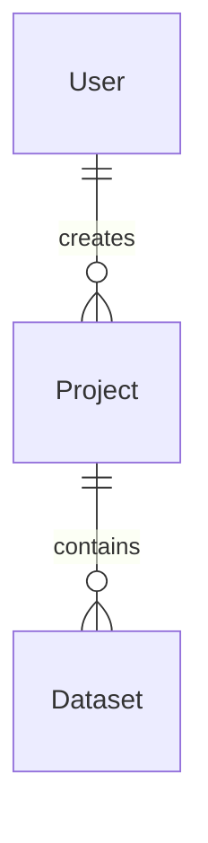

<p align="center">
  
</p>

<h1 align="center">FlowInsight AI</h1>
<p align="center"><strong>MVP v1.0</strong> — Plataforma de análisis inteligente de datos</p>

---

FlowInsight AI es una plataforma web que permite cargar datasets **CSV/XLSX**, diagnosticar y limpiar datos mediante un **pipeline ETL configurable**, generar **dashboards analíticos** con IA, obtener **insights automáticos**, conversar con el dataset mediante **chat inteligente** y generar **reportes ejecutivos en PDF**.

> **Status:** MVP v1.0 — El objetivo del MVP es demostrar el flujo completo de análisis inteligente de datos.

---

## ¿Qué problema resuelve?

Permite que usuarios sin experiencia en herramientas de Business Intelligence puedan cargar un dataset y obtener análisis visual e interpretativo de sus datos en minutos.

## Flujo principal

```
  Dataset
    ↓
  Diagnóstico
    ↓
  Limpieza ETL (opcional)
    ↓
  Dataset limpio
    ↓
  Dashboard (automático o IA)
    ↓
  Análisis IA (insights, advertencias)
    ↓
  Chat con el dataset
    ↓
  Reporte PDF profesional
```

> La limpieza es **opcional**. El usuario puede elegir *"Analizar sin modificar"* o *"Limpiar antes del análisis"*.

---

## Características principales

### 📂 Gestión de datasets
- Carga de archivos **CSV** y **XLSX**
- Registro automático en base de datos
- Selección de dataset activo
- Cambio entre datasets mediante modal con tarjetas
- Renombrado y eliminación de datasets
- Persistencia del dataset activo durante la navegación (React Context)

### � Diagnóstico
- Perfilado completo del dataset (filas, columnas, tipos, memoria)
- Vista previa de los primeros registros
- **Quality Score** con barra de progreso
- Detección de valores faltantes y duplicados
- Detección de columnas completamente vacías
- **Recomendaciones automáticas** basadas en los problemas detectados

### 🧹 Pipeline ETL
| Transformación | Descripción |
|---|---|
| Eliminar duplicados | `drop_duplicates()` |
| Eliminar valores nulos | `dropna()` |
| Normalizar texto | `.str.strip().str.title()` |
| Convertir tipos | `astype()` / `pd.to_datetime()` |
| Renombrar columnas | `rename()` |
| Filtrar filas | `query()` |

- Cada transformación tiene opción **"No hacer nada"**
- **Vista previa** del impacto antes de aplicar
- Aplicación de limpieza con botón **"Aplicar limpieza"**
- Descarga del dataset limpio
- Auto-detección de columnas de fecha (≥80% de valores válidos)

### 📊 Dashboard
- **KPIs**: total de filas, columnas, Quality Score, memoria
- Métricas por columna numérica con selector (mean, median, sum, min, max)
- **Dashboard Automático**: histograma, barras categóricas, línea temporal, heatmap de correlación
- **Dashboard IA**: gráficos generados por recomendaciones de DeepSeek
- Tabla de datos con ordenamiento, búsqueda y paginación (50 filas/página)
- Selector de modo: `Automático | IA`

### 🤖 Inteligencia Artificial (DeepSeek)
DeepSeek se utiliza para:
- Generar **insights** sobre los datos
- Detectar **advertencias** (valores nulos, duplicados, baja calidad)
- Recomendar **visualizaciones** (bar, line, scatter, pie, histogram)
- Generar el **layout lógico del dashboard**
- **Responder preguntas** sobre el dataset (chat)
- Generar contenido para el **reporte ejecutivo** PDF

### 💬 Chat con el Dataset
- Conversación contextual sobre el dataset seleccionado
- El backend construye un **contexto estructurado** y lo envía a DeepSeek
- Historial conversacional durante la sesión (últimos 6 mensajes)
- Se reinicia automáticamente al cambiar de dataset

### 📄 Reporte PDF
- Generación bajo demanda con **ReportLab**
- Secciones: portada, resumen del dataset, KPIs, resumen ejecutivo IA, hallazgos, riesgos, recomendaciones, dashboard recomendado, conclusiones
- Descarga directa como `application/pdf`

---

## Arquitectura

```
┌──────────────────────────────────────────────┐
│                  Frontend                     │
│            React 19 + TypeScript              │
│         Tailwind CSS 4 + Recharts             │
│               Axios + React Router            │
└──────────────────┬───────────────────────────┘
                   │ HTTP REST
┌──────────────────▼───────────────────────────┐
│               FastAPI (Python)                │
│                                               │
│  ┌─────────────┐  ┌──────────────────────┐    │
│  │  Routers     │  │  Services            │    │
│  │  - health    │  │  - DatasetReader     │    │
│  │  - users     │  │  - DatasetService    │    │
│  │  - projects  │  │  - ETLService        │    │
│  │  - datasets  │  │  - ETLPipeline       │    │
│  └─────────────┘  │  - AnalyticsService   │    │
│                   │  - AIService          │    │
│  ┌─────────────┐  │  - DataService        │    │
│  │  Schemas     │  │  - ReportService      │    │
│  │  (Pydantic)  │  │  - DashboardAgg       │    │
│  └─────────────┘  │  - FileStorage        │    │
│                   └──────────────────────┘    │
└──┬────────────┬──────────────┬───────────────┘
   │            │              │
   ▼            ▼              ▼
┌───────┐ ┌──────────┐ ┌──────────────┐
│Postgre│ │Sistema   │ │DeepSeek API  │
│SQL 16 │ │de archivos│ │(chat/v1)     │
└───────┘ └──────────┘ └──────────────┘
```

---

## Stack tecnológico

| Tecnología | Uso |
|---|---|
| **React 19** | UI declarativa basada en componentes |
| **TypeScript 6** | Tipado estático en frontend |
| **Vite 8** | Bundler y dev server |
| **Tailwind CSS 4** | Utilidades CSS |
| **Recharts 3** | Gráficos (Bar, Line, Scatter, Pie) |
| **Axios** | Cliente HTTP |
| **react-router-dom 7** | Navegación SPA |
| **Python 3.12** | Backend |
| **FastAPI** | API REST con OpenAPI |
| **Pydantic** | Validación de schemas |
| **SQLAlchemy 2** | ORM |
| **Alembic** | Migraciones de base de datos |
| **Pandas 3** | Procesamiento de datos |
| **OpenPyXL** | Lectura de archivos Excel |
| **ReportLab** | Generación de PDF |
| **uvicorn** | Servidor ASGI |
| **psycopg 3** | Driver PostgreSQL |
| **PostgreSQL 16** | Base de datos relacional |
| **Docker** | Contenedor PostgreSQL |
| **DeepSeek API** | Motor de IA |

---

## Procesamiento de datos

**Flujo de análisis:**

```
Archivo (CSV/XLSX)
    ↓ Pandas read_csv / read_excel
DataFrame
    ↓ DatasetReaderService.read()
    ├── Perfilado (profile)
    ├── Quality Assessment (evaluate_quality)
    ├── ETL opcional (ETLService + ETLPipelineService)
    │       └── Dataset limpio (_clean.csv/xlsx)
    └── Analytics (AnalyticsService)
```

**Flujo IA:**

```
DataFrame
    ↓ build_context()
Contexto estructurado (JSON)
    ↓ DeepSeek API
Respuesta
    ├── Insights + Warnings (HU-004)
    ├── Dashboard layout (HU-005)
    ├── Chat (HU-008)
    └── Reporte ejecutivo (HU-009)
```

---

## Context Engineering

El sistema **no envía el archivo completo** a DeepSeek. Construye un contexto estructurado (`build_context()`) con:

| Campo | Descripción |
|---|---|
| `total_rows` | Total de filas del dataset |
| `total_columns` | Total de columnas |
| `column_names` | Nombres de columnas |
| `column_types` | Tipos detectados por pandas |
| `numeric_statistics` | mean, median, min, max, std por columna numérica |
| `null_counts` | Cantidad de nulos por columna |
| `null_percentage` | Porcentaje de nulos por columna |
| `correlation_matrix` | Correlaciones entre columnas numéricas |
| `top_categories` | Top 10 valores por columna categórica |
| `sample` | Primeras 20 filas del dataset |

Este enfoque permite análisis rápidos y evita enviar datasets enormes a la API de IA.

---

## Dashboard generado por IA

```
DeepSeek → JSON { charts: [...] }
    ↓
Backend valida columnas
    ↓
Dashboard Aggregator (prepare_chart_data)
    ├── groupby + agg (bar, line)
    ├── value_counts (pie)
    ├── dropna + pares x,y (scatter)
    └── pd.cut (histogram)
    ↓
Datos agregados
    ↓
React + Recharts → Gráficos renderizados
```

> DeepSeek **no renderiza gráficos**. La IA recomienda la **estructura** y el backend prepara los **datos agregados** para que React los renderice.

---

## API

### Health
| Método | Ruta | Descripción |
|---|---|---|
| `GET` | `/` | Health check |

### Users
| Método | Ruta | Descripción |
|---|---|---|
| `GET` | `/users/` | Listar usuarios |
| `GET` | `/users/{id}` | Obtener usuario |
| `POST` | `/users/` | Crear usuario |
| `PUT` | `/users/{id}` | Actualizar usuario |
| `DELETE` | `/users/{id}` | Eliminar usuario |

### Projects
| Método | Ruta | Descripción |
|---|---|---|
| `GET` | `/projects/` | Listar proyectos |
| `GET` | `/projects/{id}` | Obtener proyecto |
| `POST` | `/projects/` | Crear proyecto |
| `PUT` | `/projects/{id}` | Actualizar proyecto |
| `DELETE` | `/projects/{id}` | Eliminar proyecto |

### Datasets
| Método | Ruta | Descripción |
|---|---|---|
| `GET` | `/datasets/` | Listar datasets |
| `GET` | `/datasets/recent` | Datasets recientes |
| `POST` | `/datasets/upload` | Subir archivo |
| `GET` | `/datasets/{id}` | Obtener dataset |
| `PATCH` | `/datasets/{id}` | Renombrar dataset |
| `DELETE` | `/datasets/{id}` | Eliminar dataset |
| `GET` | `/datasets/{id}/download` | Descargar archivo |

### Analytics
| Método | Ruta | Descripción |
|---|---|---|
| `GET` | `/datasets/{id}/profile` | Perfil del dataset |
| `GET` | `/datasets/{id}/quality` | Calidad del dataset |
| `GET` | `/datasets/{id}/analytics` | Estadísticas completas |
| `GET` | `/datasets/{id}/histogram` | Histograma de columna |
| `GET` | `/datasets/{id}/data` | Datos paginados |

### ETL
| Método | Ruta | Descripción |
|---|---|---|
| `POST` | `/datasets/{id}/pipeline` | Ejecutar pipeline |
| `POST` | `/datasets/{id}/pipeline/preview` | Vista previa del pipeline |

### AI & Chat
| Método | Ruta | Descripción |
|---|---|---|
| `GET` | `/datasets/{id}/ai-analysis` | Análisis IA (insights + layout) |
| `GET` | `/datasets/{id}/ai-dashboard-data` | Datos preparados para dashboard IA |
| `POST` | `/datasets/{id}/chat` | Chat conversacional |

### Reports
| Método | Ruta | Descripción |
|---|---|---|
| `GET` | `/datasets/{id}/report` | Generar reporte PDF |

> Abre `http://127.0.0.1:8000/docs` para la documentación interactiva Swagger/OpenAPI.

---

## Base de datos

**PostgreSQL 16** a través de Docker (`docker-compose.yml`).

### Entidades principales

| Entidad | Campos |
|---|---|
| `User` | `id`, `name`, `email`, `created_at` |
| `Project` | `id`, `name`, `description`, `created_at` |
| `Dataset` | `id`, `name`, `original_filename`, `file_path`, `file_size`, `file_type`, `created_at` |

**Esquema:**



> Los datasets se almacenan como **archivos físicos** en `backend/app/uploads/`. PostgreSQL almacena únicamente los metadatos.

---

## Instalación

### Requisitos

- **Python 3.12+**
- **Node.js 20+**
- **Docker Desktop** (para PostgreSQL)
- **API Key de DeepSeek** ([platform.deepseek.com](https://platform.deepseek.com))

### 1. Clonar el repositorio

```bash
git clone https://github.com/alberto-ipince/FlowInsight-AI.git
cd FlowInsight-AI
```

### 2. Iniciar PostgreSQL

```bash
docker compose up -d
```

### 3. Backend

```bash
cd backend
python -m venv .venv
.venv\Scripts\activate
pip install -r requirements.txt
uvicorn app.main:app --reload --port 8000
```

### 4. Frontend

```bash
cd frontend
npm install
npm run dev
```

Abre **http://localhost:5173** en el navegador.

---

## Variables de entorno

Archivo `backend/.env`:

```env
DEEPSEEK_API_KEY=your_api_key_here
DEEPSEEK_BASE_URL=https://api.deepseek.com
DEEPSEEK_MODEL=deepseek-chat
```

---

## Estructura del proyecto

```
FlowInsight-AI/
├── backend/
│   ├── app/
│   │   ├── api/v1/          # Routers FastAPI
│   │   ├── config/          # Settings
│   │   ├── core/            # Constantes
│   │   ├── database/        # Base + Session
│   │   ├── models/          # SQLAlchemy Models
│   │   ├── repositories/    # Patrón Repository
│   │   ├── schemas/         # Pydantic Schemas
│   │   └── services/        # Lógica de negocio
│   ├── alembic/             # Migraciones
│   ├── uploads/             # Archivos subidos
│   └── requirements.txt
├── frontend/
│   ├── src/
│   │   ├── api/             # Cliente Axios
│   │   ├── components/      # Header, Sidebar, Footer
│   │   ├── contexts/        # ActiveDatasetContext
│   │   ├── layouts/         # MainLayout
│   │   ├── pages/           # Home, Analytics, DataPreparation
│   │   └── services/        # aiService, chatService, healthService
│   └── package.json
├── docker-compose.yml
└── README.md
```

---

## Decisiones técnicas

### ¿Por qué Python?

El proyecto está orientado al procesamiento y análisis de datos, utilizando Pandas y el ecosistema científico de Python.

### ¿Por qué FastAPI?

Por su integración nativa con Python, tipado estático, validación mediante Pydantic y documentación automática de APIs con Swagger.

### ¿Por qué PostgreSQL?

Para persistencia estructurada de datasets, proyectos y usuarios con integridad referencial.

### ¿Por qué Docker para PostgreSQL?

Para ejecutar la base de datos de forma reproducible y aislada, sin necesidad de instalación local.

### ¿Por qué DeepSeek?

Para incorporar análisis semántico, generación de insights, recomendaciones de visualización y conversación contextual sobre los datos.

---

## Limitaciones del MVP

- El contexto enviado a la IA es **resumido/estructurado** y no incluye todas las filas de datasets muy grandes.
- La calidad de los insights depende de la **calidad de los datos** y del modelo de IA.
- El sistema está orientado a **análisis exploratorio** — no reemplaza plataformas BI empresariales.
- El historial del chat **no se persiste** en base de datos (solo en memoria durante la sesión).
- El reporte PDF no incluye gráficos incrustados.
- No hay autenticación/autenticación de usuarios en esta versión.
- El procesamiento es **síncrono** — datasets muy grandes pueden afectar los tiempos de respuesta.

---

## Roadmap

### ✅ Implementado
- Carga de CSV/XLSX
- Diagnóstico y perfilado
- Quality Score
- Pipeline ETL (6 transformaciones)
- Dashboard automático (4 gráficos + tabla)
- Dashboard IA (DeepSeek)
- Insights y advertencias IA
- Chat inteligente con el dataset
- Reporte PDF ejecutivo
- Gestión de datasets (CRUD)
- Active Dataset (persistencia entre páginas)
- Selector de modo Dashboard

### 🔮 Futuras mejoras
- Autenticación y autorización de usuarios
- Procesamiento asíncrono de datasets grandes
- Persistencia del historial de conversaciones
- Optimización con caché
- Mayor variedad de visualizaciones
- Reportes PDF con gráficos incrustados
- Despliegue en cloud
- Integración con más fuentes de datos (APIs, Google Sheets)

---

## Demo — Flujo de uso

1. **Cargar dataset** — Subir CSV o XLSX
2. **Revisar diagnóstico** — Filas, columnas, tipos, vista previa
3. **Elegir modo** — "Analizar sin modificar" o "Limpiar antes del análisis"
4. **(Opcional) Configurar ETL** — Seleccionar transformaciones y aplicar
5. **Abrir Dashboard** — KPIs, gráficos automáticos, tabla de datos
6. **Cambiar a Dashboard IA** — Ver gráficos recomendados por DeepSeek
7. **Revisar Insights IA** — Observaciones y advertencias generadas
8. **Conversar con el Chat** — Preguntar sobre los datos
9. **Generar Reporte PDF** — Descargar reporte ejecutivo

---

## Capturas de pantalla

<!-- Agregar capturas en docs/images/ -->
<!-- -  -->
<!-- -  -->
<!-- -  -->
<!-- -  -->
<!-- -  -->
<!-- -  -->
<!-- -  -->

---

<p align="center">
  <sub>Built with ❤️ by <a href="https://github.com/alberto-ipince">Alberto Ipince</a></sub>
</p>